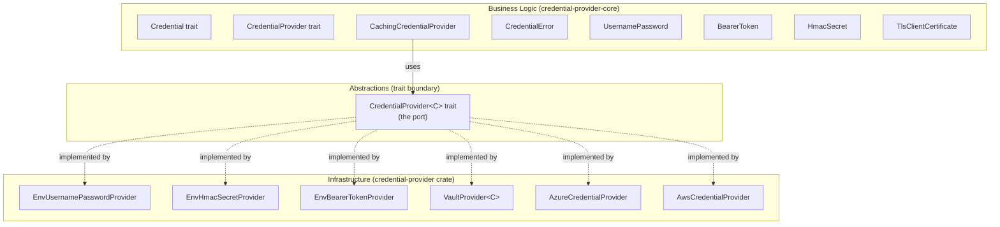

# Architecture

This document defines the clean architecture boundaries for the `credential-provider` workspace — what constitutes business logic, what are the abstractions, and what are the infrastructure implementations.

---

## Boundary Diagram



---

## Business Logic (credential-provider-core)

The core crate contains all domain concepts and behavioral rules. It has **no knowledge** of any secrets backend.

### Credential Validity

- A credential with no expiry is always valid
- A credential with an expiry in the future is valid
- A credential with an expiry in the past is invalid
- Validity is determined by comparing `expires_at()` against the current time

### Caching Policy

The caching policy is the most complex piece of business logic in the workspace:

1. **Empty cache:** Fetch immediately, cache result, return it
2. **Valid cache, outside refresh window:** Return cached value (no fetch)
3. **Valid cache, inside refresh window:** Fetch fresh credential
   - On success: Update cache, return new value
   - On failure: Return stale cached credential (stale fallback)
4. **Expired cache:** Fetch fresh credential
   - On success: Update cache, return new value
   - On failure: Return `CredentialError` (no fallback for expired credentials)
5. **Concurrent requests during refresh:** Only one fetch in flight; all waiters get the same result

### Error Classification

Errors are classified by **cause category** so consumers can decide how to react:

| Category | Meaning | Typical reaction |
|---|---|---|
| Backend | Store responded with an error | Retry with backoff |
| Unreachable | Store could not be contacted | Retry, check network |
| Configuration | Provider is misconfigured | Fix deployment config |
| Unavailable | No credential and no cache | Fail the operation |
| Revoked | Credential was explicitly revoked | Re-authenticate |

---

## Abstractions (the Port)

The `CredentialProvider<C>` trait is the **single port** in this architecture. It is the boundary that separates business logic from infrastructure.

### Contract

- `get()` returns `Result<C, CredentialError>` where `C: Credential`
- Implementations must not cache internally
- Implementations must be safe for concurrent calls (`Send + Sync + 'static`)
- Implementations must translate all backend-specific errors into `CredentialError`

### Why a Single Trait

The provider trait is intentionally minimal — a single `get()` method. There is no `revoke()`, `rotate()`, `list()`, or `health_check()`. This keeps the abstraction narrow and easy to implement. Credential lifecycle management (rotation, revocation) is an operator concern handled outside this crate.

---

## Infrastructure (credential-provider crate)

Each adapter implements `CredentialProvider<C>` for a specific backend and credential type combination.

### Adapter Responsibilities

Every adapter is responsible for:

1. **Connection management** — Holding a reference to the backend client (VaultClient, AWS config, etc.)
2. **Request translation** — Calling the backend SDK with the correct path/scope/parameters
3. **Response translation** — Extracting credential data from the backend response and constructing the appropriate credential type
4. **Error translation** — Mapping backend-specific errors to `CredentialError` variants
5. **Expiry extraction** — Deriving `expires_at` from the backend response (lease duration, token expiry, etc.)

### Vault Error Mapping

All Vault providers share a common error mapping:

| Vault / vaultrs condition | CredentialError variant |
|---|---|
| HTTP 403 Forbidden | `Backend("permission denied")` |
| HTTP 404 Not Found | `Configuration("role or path not found: {path}")` |
| Connection refused / timeout | `Unreachable("{details}")` |
| Lease expired on re-read | `Revoked` |
| Malformed response | `Backend("unexpected response: {details}")` |

### Feature Flag Mapping

| Feature | Adapters enabled | External dependencies |
|---|---|---|
| `env` (default) | `EnvUsernamePasswordProvider`, `EnvHmacSecretProvider`, `EnvBearerTokenProvider` | None |
| `vault` | `VaultProvider<C>` (generic, works with any secrets engine) | `vaultrs`, `tokio` |
| `azure` | `AzureCredentialProvider` | `azure-identity`, `azure-core` |
| `aws` | `AwsCredentialProvider` | `aws-config`, `aws-credential-types` |

---

## Dependency Direction

```
Consumer library
    → depends on credential-provider-core (traits + types only)

Application binary
    → depends on credential-provider (with feature flags)
        → depends on credential-provider-core
        → optionally depends on vaultrs, azure-identity, aws-config
```

**Hard rule:** The core crate NEVER depends on the adapter crate. The dependency arrow always points inward (infrastructure → business logic).

**Hard rule:** Consumer libraries NEVER depend on `credential-provider` directly. They take `Arc<dyn CredentialProvider<C>>` or `Arc<CachingCredentialProvider<C, P>>` as injected dependencies.

---

## Data Flow Across Boundaries

### Credential Fetch (Happy Path)

```
Consumer → CachingCredentialProvider.get()
    → checks cache (RwLock read)
    → cache miss or refresh needed
    → acquires write lock
    → calls inner CredentialProvider.get()
        → adapter calls backend SDK
        → backend returns raw data
        → adapter constructs Credential value
        → adapter returns Result<C, CredentialError>
    → CachingCredentialProvider stores in cache
    → returns credential to consumer
```

### Credential Fetch (Stale Fallback)

```
Consumer → CachingCredentialProvider.get()
    → checks cache (RwLock read)
    → cache within refresh window
    → acquires write lock
    → calls inner CredentialProvider.get()
        → adapter calls backend SDK
        → backend returns error (timeout, 500, etc.)
        → adapter returns Err(CredentialError)
    → CachingCredentialProvider checks: is cached credential still valid?
    → YES: returns stale cached credential
    → NO: propagates CredentialError
```

### What Crosses the Boundary

| Direction | What crosses | Type |
|---|---|---|
| Into adapter | Nothing (adapter has its own config) | — |
| Out of adapter | Fresh credential | `Result<C, CredentialError>` |
| Into cache | Fresh credential from adapter | `C: Credential` |
| Out of cache | Cached or fresh credential | `Result<C, CredentialError>` |

The boundary is clean: only `Credential` values and `CredentialError` values cross between infrastructure and business logic. No backend-specific types leak through.
