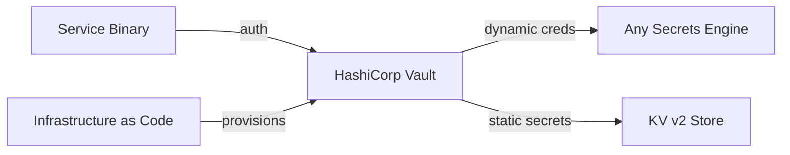

# Operations

Deployment patterns, observability, and configuration guidance for the `credential-provider` workspace.

---

## Deployment Patterns

### Self-Hosted (Vault)

- Services authenticate to Vault using an appropriate auth method (AppRole, JWT/OIDC, Kubernetes, etc.)
- `VaultProvider::dynamic_credentials(...)` fetches dynamic credentials from any engine (RabbitMQ, database, SSH, etc.)
- `VaultProvider::kv2_secret(...)` fetches static secrets (HMAC keys, API tokens, webhook secrets)
- `VaultProvider::pki_certificate(...)` fetches TLS certificates from Vault PKI
- `VaultProvider::with_extractor(...)` supports any custom engine
- Application constructs `VaultClient`, authenticates, then passes it to providers

### Azure Deployment

- Services use **Managed Identity** or **Workload Identity** (Kubernetes)
- `AzureCredentialProvider` delegates to `azure-identity` credential chain
- No explicit credentials to provision — identity is assigned at infrastructure level

### AWS Deployment

- Services use **IAM roles** (EC2 instance role, ECS task role, EKS service account)
- `AwsCredentialProvider` delegates to `aws-config` credential chain
- No explicit credentials to provision — role is assigned at infrastructure level

### Local Development

- Use `.env` file (never committed) with `EnvUsernamePasswordProvider` and `EnvHmacSecretProvider`
- No external services required
- Application wiring code is identical — only provider construction changes

---

## Configuration

### Refresh Window Guidance

| Backend | Typical lease/token lifetime | Recommended `refresh_before_expiry` |
|---|---|---|
| Vault dynamic engines | 1 hour (default) | 60 seconds |
| Vault KV v2 / static | No expiry | 300 seconds (re-read interval) |
| Azure token | ~1 hour | 300 seconds |
| AWS credentials | 1–12 hours | 300 seconds |
| Env variables | No expiry | 300 seconds (re-read interval) |

For static-secret providers (KV v2 and env) which return credentials with no expiry, the `refresh_before_expiry` value acts as a periodic re-read interval. Since credentials never expire, the cache never enters the refresh window automatically. The CachingCredentialProvider should treat no-expiry credentials as indefinitely valid — re-reading is only triggered if the application explicitly invalidates the cache (if such an API is provided) or restarts.

**Clarification:** For no-expiry credentials, `CachingCredentialProvider` will cache them forever (until process restart). If external rotation is expected (e.g., KV v2 secret updated), the application must restart or implement an explicit invalidation mechanism outside this crate's scope.

---

## Observability

### Recommended Metrics

This crate does not include logging or metrics directly (to avoid forcing a specific framework on consumers). However, consumers and applications should instrument the following:

| Metric | Type | Description |
|---|---|---|
| `credential_fetch_total` | Counter | Total calls to inner provider `get()` (not cache hits) |
| `credential_fetch_errors_total` | Counter | Failed fetches, labeled by `CredentialError` variant |
| `credential_cache_hits_total` | Counter | Number of `get()` calls served from cache |
| `credential_cache_stale_fallbacks_total` | Counter | Number of times stale fallback was used |
| `credential_fetch_duration_seconds` | Histogram | Time spent in inner provider `get()` |
| `credential_expiry_remaining_seconds` | Gauge | Time until cached credential expires |

### Recommended Log Points

| Event | Level | Context |
|---|---|---|
| Credential fetched successfully | `debug` | Provider type, credential type (not values) |
| Credential fetch failed | `warn` | Provider type, error variant, error message |
| Stale fallback used | `warn` | Provider type, remaining validity of stale credential |
| Cache populated (first fetch) | `info` | Provider type, credential type |
| Cache refreshed | `debug` | Provider type, old expiry → new expiry |

**Important:** Log messages must NEVER include credential values. Only log credential metadata (type, expiry time, provider name).

---

## Startup Behavior

### Recommended Startup Sequence

1. Application reads configuration (Vault address, feature flags, etc.)
2. Application authenticates to Vault (if using Vault backend)
3. Application constructs providers and wraps them in `CachingCredentialProvider`
4. Application calls `get()` on each provider to populate the cache (fail-fast startup)
5. Application passes providers to library consumers and starts serving

Step 4 is optional but recommended. It ensures that credential backends are reachable before the application starts accepting traffic. Without this, the first user request would trigger the initial credential fetch, adding latency.

### Startup Failure Handling

If step 4 fails:

- **Vault unreachable:** Log error and retry with backoff. Do not start serving until credentials are available.
- **Configuration error:** Log error and exit immediately. This is a deployment problem that requires operator intervention.
- **Permission denied:** Log error and exit. The Vault policy is misconfigured.

---

## Scaling Considerations

### Credential Fetch Rate

Each `CachingCredentialProvider` instance has its own cache. In a single-process application, there is exactly one cache per provider. Scaling to multiple processes means each process independently fetches credentials from the backend.

For Vault dynamic credentials (RabbitMQ), this means N processes × M providers = N×M lease acquisitions per refresh cycle. Vault can handle this easily for typical service counts (< 100 processes).

For cloud providers (Azure, AWS), the SDK handles rate limiting internally.

### No Cross-Process Cache Sharing

The caching layer is in-process only. There is no shared cache across processes or nodes. This is intentional — sharing a credential cache would require a distributed cache system, which would itself need credentials to access (circular dependency).
