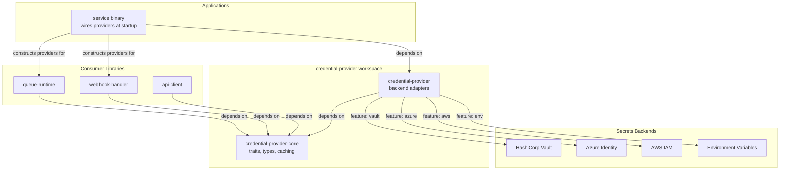
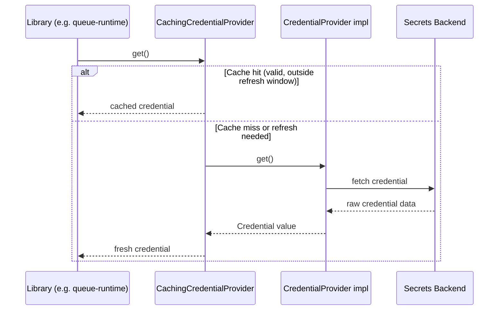

# System Overview

## Context

Rust services frequently need credentials at runtime — queue broker connections (RabbitMQ), webhook signature validation (GitHub), API tokens, TLS certificates, and cloud provider identities. Each service may run in different environments (local development, self-hosted infrastructure with Vault, Azure, AWS) and must obtain credentials from whichever secrets backend is available without coupling service logic to a specific backend.

`credential-provider` solves this by separating the *concept* of obtaining credentials from the *mechanism* of obtaining them.

## System Context Diagram



## Crate Relationship

The workspace contains exactly two crates with a strict dependency direction:

```
credential-provider-core    (port definitions — traits, types, caching)
        ↑
credential-provider         (adapter implementations — env, vault, azure, aws)
```

- **credential-provider-core** has no knowledge of any backend. It defines what credentials *are* and how they behave.
- **credential-provider** knows how to *fetch* credentials from specific backends and translate them into the core types.

Consumer libraries depend **only** on `credential-provider-core`. Applications depend on `credential-provider` (which re-exports core) and wire concrete providers at startup.

## High-Level Data Flow



## Design Goals

1. **Decoupling** — Service code never knows which backend provides credentials
2. **Minimal core** — The trait crate is cheap for any library to depend on
3. **Transparent lifecycle** — Caching, refresh, and fallback are invisible to consumers
4. **Memory safety for secrets** — All sensitive values are zeroed on drop
5. **Compile-time backend selection** — Feature flags prevent unused backend SDKs from being compiled
6. **Testability** — The `env` provider and `MockCredentialProvider` enable testing without external services
