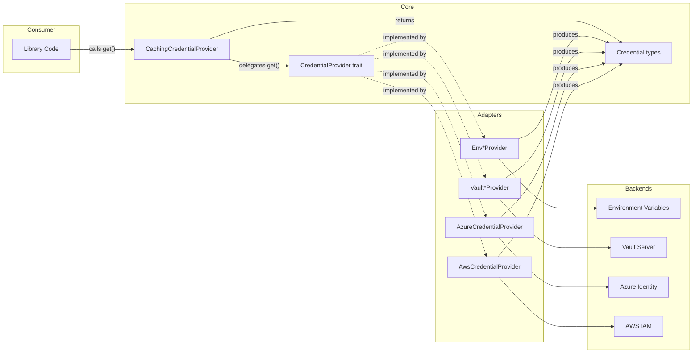

# Responsibilities

This document uses Responsibility-Driven Design (RDD) to define what each component **knows** (data it holds) and **does** (operations it performs), along with its **collaborators** (components it delegates to).

---

## credential-provider-core

### Credential (trait)

**Responsibilities:**

- Knows: Whether it is currently usable
- Knows: When it expires (if applicable)
- Does: Reports validity status
- Does: Reports expiry time

**Collaborators:** None (leaf contract)

**Role:** Contract — defines the interface that all credential types must satisfy.

---

### UsernamePassword

**Responsibilities:**

- Knows: Username (plain text)
- Knows: Password (secret, zeroed on drop)
- Knows: Optional expiry instant
- Does: Reports validity based on expiry vs. current time

**Collaborators:** None

**Role:** Value object — immutable data carrier for username/password credentials.

---

### BearerToken

**Responsibilities:**

- Knows: Token value (secret, zeroed on drop)
- Knows: Optional expiry instant
- Does: Reports validity based on expiry vs. current time

**Collaborators:** None

**Role:** Value object — immutable data carrier for bearer token credentials.

---

### HmacSecret

**Responsibilities:**

- Knows: Key bytes (secret, zeroed on drop)
- Does: Always reports valid (no expiry concept)

**Collaborators:** None

**Role:** Value object — immutable data carrier for HMAC keys. Rotation is external.

---

### TlsClientCertificate

**Responsibilities:**

- Knows: Certificate PEM (secret, zeroed on drop)
- Knows: Private key PEM (secret, zeroed on drop)
- Knows: Optional expiry instant
- Does: Reports validity based on expiry vs. current time

**Collaborators:** None

**Role:** Value object — immutable data carrier for mTLS client certificates.

---

### CredentialProvider (trait)

**Responsibilities:**

- Knows: How to reach a specific backing store
- Does: Fetches a fresh credential on every call to `get()`
- Does: Translates backend-specific errors into `CredentialError`

**Collaborators:** Backend-specific clients (deferred to implementations)

**Role:** Port — the abstraction that consumers depend on. Implementations live in the adapter crate.

---

### CachingCredentialProvider

**Responsibilities:**

- Knows: The inner provider (a `CredentialProvider<C>`)
- Knows: The currently cached credential (if any)
- Knows: The refresh-before-expiry window duration
- Does: Returns cached credential when valid and outside refresh window
- Does: Triggers refresh when cached credential is within the refresh window or expired
- Does: Serializes concurrent refresh requests (one fetch in flight at a time)
- Does: Falls back to stale-but-valid cached credential when refresh fails
- Does: Propagates error when cache is empty and refresh fails

**Collaborators:**

- `CredentialProvider<C>` (inner) — delegates credential fetching

**Role:** Orchestrator — manages the caching lifecycle transparently. This is the component consumers actually interact with.

---

### CredentialError

**Responsibilities:**

- Knows: Error classification (backend, unreachable, configuration, unavailable, revoked)
- Knows: Contextual error message
- Does: Provides categorized error information for callers to act on

**Collaborators:** None

**Role:** Error type — the shared error vocabulary across all providers.

---

## credential-provider (adapters)

### EnvUsernamePasswordProvider

**Responsibilities:**

- Knows: Environment variable name for username
- Knows: Environment variable name for password
- Does: Reads both environment variables on every call to `get()`
- Does: Returns `CredentialError::Configuration` if either variable is missing or empty
- Does: Constructs `UsernamePassword` with no expiry

**Collaborators:** `std::env` (reads environment variables)

**Role:** Adapter — translates environment variables into `UsernamePassword` credentials.

---

### EnvHmacSecretProvider

**Responsibilities:**

- Knows: Environment variable name for the HMAC secret
- Does: Reads the environment variable on every call to `get()`
- Does: Decodes hex or base64 encoding
- Does: Returns `CredentialError::Configuration` if variable is missing, empty, or invalid encoding
- Does: Constructs `HmacSecret`

**Collaborators:** `std::env` (reads environment variables)

**Role:** Adapter — translates an environment variable into an `HmacSecret` credential.

---

### EnvBearerTokenProvider

**Responsibilities:**

- Knows: Environment variable name for the bearer token
- Does: Reads the environment variable on every call to `get()`
- Does: Returns `CredentialError::Configuration` if variable is missing or empty
- Does: Constructs `BearerToken` with no expiry

**Collaborators:** `std::env` (reads environment variables)

**Role:** Adapter — translates an environment variable into a `BearerToken` credential.

---

### VaultProvider\<C\>

**Responsibilities:**

- Knows: Reference to an authenticated `VaultClient`
- Knows: Mount path and request path for the target secrets engine
- Knows: A response extraction strategy that maps Vault JSON responses to credential type `C`
- Does: Reads from any Vault secrets engine path
- Does: Delegates response-to-credential translation to the configured extractor
- Does: Translates Vault lease duration into credential expiry (for dynamic engines)
- Does: Maps Vault HTTP errors to `CredentialError` variants (see Error Mapping in architecture.md)

**Collaborators:**

- `VaultClient` (from `vaultrs` — performs HTTP requests to Vault)
- Response extractor (maps engine-specific JSON to `C`)

**Role:** Adapter — translates Vault secrets engine responses into credential types. A single generic provider supports all Vault engines via configurable extraction. Convenience constructors are provided for common engine patterns (KV v2, dynamic credentials engines like RabbitMQ/database/etc.).

---

### AzureCredentialProvider

**Responsibilities:**

- Knows: OAuth2 scope for the target resource
- Does: Delegates to the Azure Identity credential chain
- Does: Constructs `BearerToken` with expiry from the Azure token response
- Does: Maps Azure Identity errors to `CredentialError` variants

**Collaborators:** `azure-identity` `DefaultAzureCredential` (resolves credentials via chain)

**Role:** Adapter — translates Azure Identity tokens into `BearerToken` credentials.

---

### AwsCredentialProvider

**Responsibilities:**

- Knows: AWS credential chain configuration
- Does: Resolves credentials via the `aws-config` credential chain
- Does: Constructs `AwsCredentials` with expiry from the AWS response
- Does: Maps AWS credential errors to `CredentialError` variants

**Collaborators:** `aws-config` credential chain (resolves credentials)

**Role:** Adapter — translates AWS credential chain output into `AwsCredentials`.

---

### MockCredentialProvider (test support)

**Defined in:** `credential-provider-core` (canonical location). Re-exported by `credential-provider` behind the `test-support` feature for convenience.

**Responsibilities:**

- Knows: A pre-configured return value or sequence of return values
- Does: Returns the configured credential or error on each call to `get()`
- Does: Optionally tracks call count for test assertions

**Collaborators:** None

**Role:** Test double — allows tests to control credential provider behavior precisely.

**Availability:** Only under `cfg(any(test, feature = "test-support"))`. Must never be compiled into production builds.

---

## Collaboration Diagram

